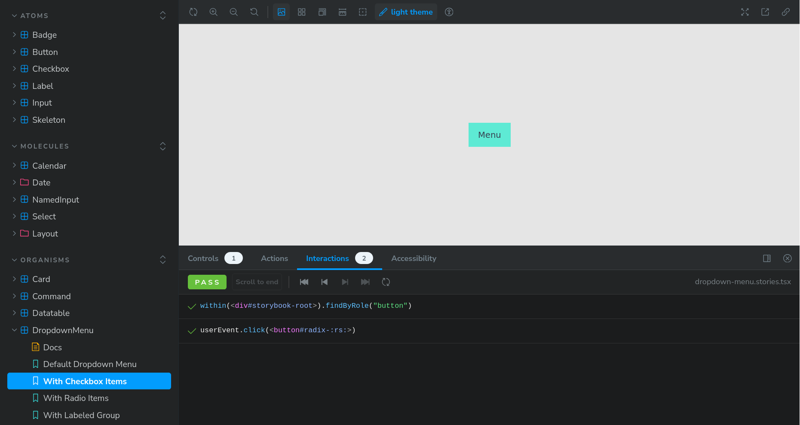

import { LocaleCheck }  from "@/components"

<LocaleCheck locale="fr">
## Contexte

Koudi est une entreprise de distribution qui gère plusieurs points de vente et entrepôts.
Avant Akojo, Koudi gérait ses flux de stock avec plusieurs fichiers Excel. Cela créait plusieurs problèmes, comme :

- **Intégrité des données :** Il n’y avait pas une seule source fiable. Chaque membre avait sa propre version des fichiers. Cela provoquait des erreurs dans le comptage et les rapports de stock.
- **Problèmes de collaboration :** Partager et modifier les fichiers Excel entre plusieurs personnes créait des conflits et de l’incohérence. Par exemple, un même produit avec plusieurs noms.
- **Erreurs humaines :** Les erreurs passaient souvent inaperçues jusqu’à ce qu’elles causent des problèmes opérationnels ou financiers. Quand il manquait du stock ou qu’il y avait trop de stock, personne ne savait d’où ça venait.

## Résultat

On voulait créer une plateforme unique pour gérer les stocks. Voici ce qu’on a réussi à faire :

- **Une seule source fiable :** Les niveaux de stock sont visibles par tout le monde. On enregistre chaque mouvement de stock, que ce soit une vente ou un réapprovisionnement.
- **Collaboration :** Tout le monde peut accéder au système, mais selon son rôle. Un système simple de rôles permet à chacun d’utiliser l’application, du manager à la boutique.
- **Moins d’effort manuel :** En gérant tout ce qui est lié au stock, on a réduit le temps et l’effort pour créer des bons de livraison ou synchroniser le stock.

## Processus

Pour garantir la qualité et la facilité d’utilisation, l’équipe a utilisé une méthode agile centrée sur l’utilisateur :

- **Méthode Agile :** On a utilisé GitHub Project pour gérer chaque fonctionnalité comme un mini produit. Cela nous a permis de suivre tout le cycle de vie du logiciel.
- **Design Centré sur l’Utilisateur :** Après des interviews avec les utilisateurs, on a créé des maquettes simples (low-fidelity) pour chaque fonctionnalité. Ensuite, on a développé un prototype dans Storybook. Les retours des utilisateurs ont permis d’améliorer le design avant de le coder.

### Design

On a suivi la méthode de design atomique. D’abord, on a créé nos atomes et molécules avec shadcn/ui. Pour chaque fonctionnalité, après une réunion avec les utilisateurs, on a fait une maquette simple qu’on a transformée en prototype dans Storybook. L’utilisateur testait et donnait son avis, qu’on intégrait dans le processus final.
</LocaleCheck>

<LocaleCheck locale="en">
## Context

Koudi is a distribution company that manages multiple sales points and warehouses.
Before Akojo, Koudi managed its stock flows with several Excel files. This created several problems, such as:

- **Data Integrity:** There was no single reliable source. Each member had their own version of the files. This caused errors in stock counting and reporting.
- **Collaboration Issues:** Sharing and modifying Excel files among multiple people created conflicts and inconsistencies. For example, the same product with different names.
- **Human Errors:** Errors often went unnoticed until they caused operational or financial problems. When stock was missing or there was too much stock, no one knew where it came from.

## Outcome

We wanted to create a unique platform to manage stocks. Here's what we achieved:

- **A Single Reliable Source:** Stock levels are visible to everyone. Every stock movement, whether a sale or a replenishment, is recorded.
- **Collaboration:** Everyone can access the system, but according to their role. A simple role-based system allows everyone, from managers to shop staff, to use the application.
- **Less Manual Effort:** By managing everything related to stock, we reduced the time and effort required to create delivery slips or synchronize stock.

## Process

To ensure quality and ease of use, the team used an agile, user-centered method:

- **Agile Methodology:** We used GitHub Project to manage each feature as a mini product. This allowed us to track the entire software lifecycle.
- **User-Centered Design:** After user interviews, we created simple (low-fidelity) mockups for each feature. Then, we developed a prototype in Storybook. User feedback helped improve the design before coding.

### Design

We followed the atomic design method. First, we created our atoms and molecules with shadcn/ui. For each feature, after a meeting with users, we made a simple mockup that we turned into a prototype in Storybook. The user tested and gave feedback, which we integrated into the final process.
</LocaleCheck>

<LocaleCheck locale="yo">
## Àkójọpọ̀

Koudi jẹ́ ilé-iṣẹ́ ìtànkálẹ̀ tí ó ń ṣètò àwọn ibi títà àti àwọn ilé ìtajà lọ́pọ̀lọpọ̀.
Ṣáájú Akojo, Koudi ń ṣètò àwọn ìṣàkóso ọja rẹ̀ pẹ̀lú àwọn fáìlì Excel lọ́pọ̀lọpọ̀. Èyí mú àwọn ìṣòro tó yàtọ̀ yàtọ̀ wá, bíi:

- **Ìdájọ́ Ìdáta:** Kò sí orísun tó dájú kan ṣoṣo. Olúkúlùkù ọmọ ẹgbẹ́ ní ẹ̀dà fáìlì tirẹ̀. Èyí mú àwọn aṣìṣe wá nínú ìkànsí àti ìròyìn ọja.
- **Ìṣòro Ìfọwọ́sowọ́pọ̀:** Pínpín àti ṣíṣàtúnṣe fáìlì Excel láàárín àwọn ènìyàn púpọ̀ mú àwọn ìjà àti àìṣòkan wá. Bí àpẹẹrẹ, ọjà kan pẹ̀lú àwọn orúkọ tó yàtọ̀.
- **Àṣìṣe Ènìyàn:** Àṣìṣe máa ń lọ láìsí ìkànsí títí tí wọ́n fi ń fa àwọn ìṣòro iṣẹ́ tàbí owó. Nígbà tí ọja kò sí tàbí tí ó pọ̀ jù, kò sí ẹni tó mọ ibi tó ti wá.

## Àbájáde

A fẹ́ dá pẹpẹ kan tó yàtọ̀ fún ṣíṣàkóso àwọn ọja. Èyí ni ohun tí a ṣàṣeyọrí:

- **Orísun Tó Dájú Kan Ṣoṣo:** Gbogbo ènìyàn lè rí ìpele ọja. A máa ń ṣe ìgbàgbọ̀ gbogbo ìrìnàjò ọja, bí ó ti jẹ́ títà tàbí ìtunṣe.
- **Ìfọwọ́sowọ́pọ̀:** Gbogbo ènìyàn lè wọlé sí ètò náà, ṣùgbọ́n ní ìbámu pẹ̀lú ipa wọn. Ètò ipa tó rọrùn jẹ́ kí gbogbo ènìyàn, láti ọdọ alábòójútó dé ibi títà, lè lò àpérò náà.
- **Díẹ̀ Kéré Nínú Ìsapá Mánùálì:** Nípa ṣíṣàkóso gbogbo ohun tó ní í ṣe pẹ̀lú ọja, a dín àkókò àti ìsapá tó jẹ́ dandan fún ṣíṣe àwọn ìwé ìfiránṣẹ́ tàbí ìṣọ̀kan ọja kù.

## Ilépa

Láti dájú pé àkóónú àti ìrọrun lójú, ẹgbẹ́ náà lò ọ̀nà agile tó dá lórí oníbàárà:

- **Ọ̀nà Agile:** A lò GitHub Project láti ṣètò gbogbo ànfàní bíi ọjà kékeré. Èyí jẹ́ kí a lè tọ́pa gbogbo ìgbésẹ̀ ìgbésí-ayé sọ́fitiwérì náà.
- **Àpẹrẹ Tó Dá Lórí Oníbàárà:** Lẹ́yìn ìfọrọ̀wánilẹ́nuwò pẹ̀lú àwọn oníbàárà, a dá àwọn àpẹrẹ tó rọrùn (low-fidelity) fún gbogbo ànfàní. Lẹ́yìn náà, a dá àpẹẹrẹ kan nínú Storybook. Àwọn ìdáhùn àwọn oníbàárà ṣe iranlọwọ láti mú àpẹrẹ náà dára ṣáájú ṣíṣàtúnṣe.

### Àpẹrẹ

A tẹ̀lé ọ̀nà àpẹrẹ atomiki. Ní ìbẹ̀rẹ̀, a dá àwọn atomu àti molikúlì wa pẹ̀lú shadcn/ui. Fún gbogbo ànfàní, lẹ́yìn ìpàdé pẹ̀lú àwọn oníbàárà, a ṣe àpẹrẹ tó rọrùn tí a yí padà sí àpẹẹrẹ nínú Storybook. Oníbàárà náà ṣe ìdánwò àti fúnni ní ìdáhùn, èyí tí a fi sínú ìlànà ìkẹyìn.
</LocaleCheck>
