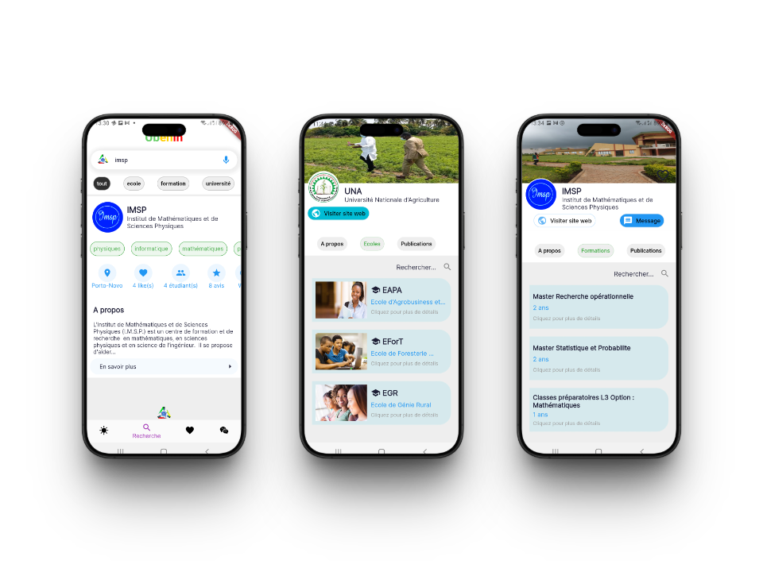
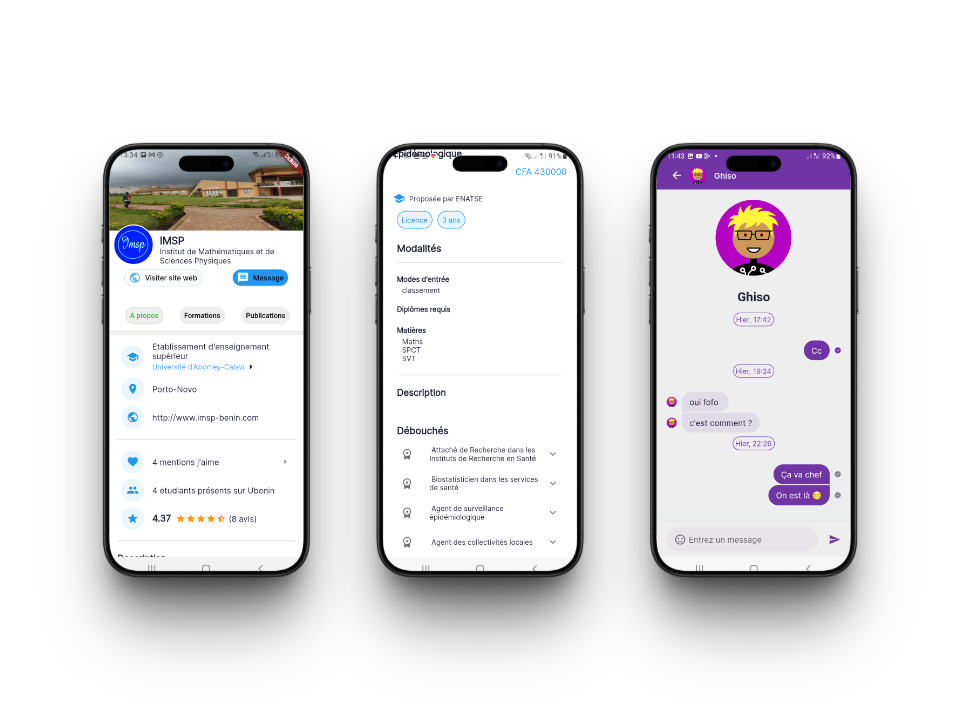

## Contexte

> Pourquoi Ubénin ?

L’idée d’Ubénin est née d’un constat simple partagé par Donatien : la recherche de formations universitaires au Bénin est souvent longue, confuse et peu encadrée, en particulier pour les nouveaux bacheliers. L’orientation dans l’enseignement supérieur au Bénin manque de clarté, de centralisation et de retours d’expérience fiables.

Face à ce constat, nous avons imaginé une plateforme capable de centraliser les données essentielles, de faciliter l’échange entre étudiants et de rendre plus lisible le paysage de l’enseignement supérieur béninois.

> Quels bénéfices pour la communauté éducative ?

Ubénin s’adresse à toute une génération de futurs bacheliers en quête de repères, mais aussi aux étudiants qui souhaitent se réorienter ou approfondir leur parcours. Les établissements d’enseignement supérieur y trouvent également un espace de visibilité, tandis que les alumni peuvent y partager leurs expériences et guider les plus jeunes.

En créant un lien direct entre ces acteurs, Ubénin contribue à construire une communauté éducative plus solidaire, plus informée, et tournée vers l’avenir.

## Valeurs

Ubénin repose sur ces piliers essentiels qui guident à la fois son fonctionnement et son utilité auprès de ses utilisateurs.

> Orientation et Découverte

Ubénin accompagne les étudiants dans leurs choix en leur offrant une vision claire et accessible du paysage universitaire béninois. Grâce à une interface intuitive, ils peuvent explorer les différentes filières, comparer les établissements et découvrir des opportunités auxquelles ils n’auraient peut-être pas pensé.

> Avis et Communication

L’application encourage le partage d’expériences à travers les avis d’anciens étudiants et la possibilité d’échanger directement avec d’autres membres de la communauté. Ce lien direct favorise une prise de décision plus informée et alimente une dynamique d’entraide entre les générations.

> Répertoire Centralisé

Ubénin centralise les informations clés sur les établissements d’enseignement supérieur du Bénin. L’utilisateur accède en quelques clics à une base de données fiable, régulièrement mise à jour, qui réunit les principales universités, écoles et formations disponibles dans le pays.

## Réalisation

En équipe avec Donatien, Roméo et Ghislain
Concernant les technologies utilisées, flutter est notre outil de développement.
Pour la base de données des universités, nous avons opté pour Firebase de Google.
Le serveur de chat est implémenté avec la technologie Socket.io en NodeJS.
