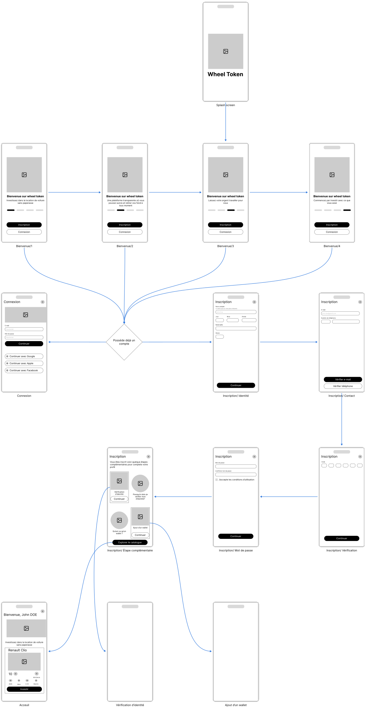

import {ColumnLayout, Carousel}  from "@/components"
import GoogleTrendsRevenuPassif from "../../assets/images/wheel-token/google_trends_revenu_passif.png"
import GoogleTrendsLocationVoiture from "../../assets/images/wheel-token/google_trends_location_de_voiture.png"
import StatistaCovoiturage from "../../assets/images/wheel-token/statista_covoiturage_user_2017_2023_2029.png"

export const contexteStats = [
  { 
    src: GoogleTrendsRevenuPassif, 
    alt: "Tendance de l'intêret sur le revenues passif" 
  }, 
  {
    src: GoogleTrendsLocationVoiture, 
    alt: "Tendance de l'intêret sur le covoiturage"
  }, 
  {
    src: StatistaCovoiturage,
    alt: "État et prévision des utilisateurs des application de covoiturage" 
  }];

## Contexte
<ColumnLayout>
  

    L’investissement dans la location automobile reste aujourd’hui un privilège réservé à une minorité. En effet, le coût d’entrée est très élevé et demande une bonne connaissance des démarches juridiques et fiscales. En parallèle, l'intérêt pour **le covoiturage** connaît un essor avec les plateformes telles qu’Uber, BlaBlaCar, etc.

    Ceci est une opportunité  de réduire la barrière à l'entrée grâce à **la tokenisation d'actifs**. La tokenisation d'actifs est un processus qui permet de créer des jetons numériques représentant la possession d'un bien physique ou numérique stocké dans la blockchain. La blockchain est utilisée ici pour garantir que dès qu’un jeton est acheté, aucune autorité ne peut la renier ou la supprimer.

    Notre objectif est de permettre à chacun de **devenir investisseur, sans paperasse** ni expertise technique

  

<Carousel images={contexteStats}/>

</ColumnLayout>
## Recherche
<ColumnLayout>

  Pour la recherche utilisateur, nous avons interviewé des utilisateurs familiers avec la blockchain et d'autres qui ne le sont pas. Voici les points clés que nous avons retenus:
  - **Manque de confiance** : La plupart de ceux qui n'étaient pas familiers avec la crypto ne faisaient pas confiance à cela, citant des scams
  - **Intérêt pour le revenu passif** : L'idée de pouvoir facilement investir dans une voiture et avoir des revenus a beaucoup intéressé
  - **Importance de la liquidité** : Les investisseurs veulent pouvoir facilement échanger leur token dans le cas où ils ne sont plus intéressés 
  - **Nécessité de la transparence** : Ils veulent comprendre comment leur revenu est généré et savoir ce qui se passe dans les cas où l'entreprise disparaît

  Nous avons décider de nous concentrer sur la transparence pour permttre a l'utilisateur de comprendre exactement ce qui se passe

<figure class="image">

  
 <figcaption> </figcaption>

</figure>
<figure class="image">

  
 <figcaption> </figcaption>

</figure>

</ColumnLayout>

## Design

Étant donné la complexité et le manque de vulgarisation de la tokenisation d'actif, nous avons opté pour un design orienté autour d'une divulgation progressive avec un ensemble de matériel qui a pour but d'aider l'utilisateur à comprendre tout ce qu'il y a autour du domaine

> Onboarding flow

> Maquettes

